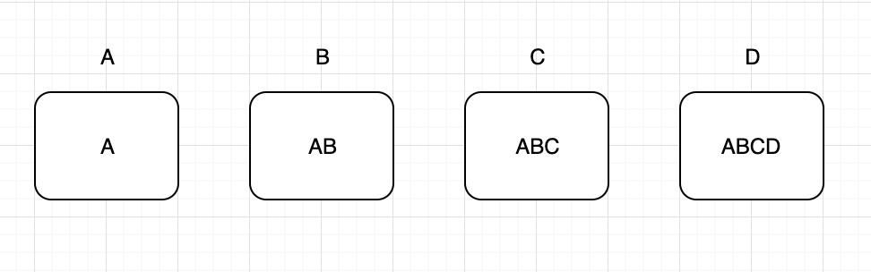
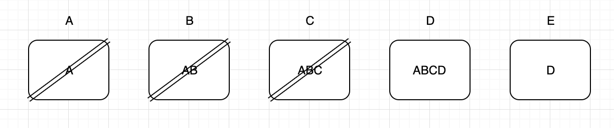

<p align="center">
  <b style="font-size: 32px;">Action Callback Bots | Web3 Batched Send</b>
</p>

<p align="center">
  <a href="https://standardjs.com"></a>
  <a href="https://travis-ci.org/kleros/action-callback-bots"></a>
  <a href="https://conventionalcommits.org"></a>
  <a href="http://commitizen.github.io/cz-cli/"></a>
  <a href="https://github.com/prettier/prettier"></a>
</p>

This repo houses a collection of bots that call smart contract action callbacks, and a utility for sending queued batches of transactions efficiently that is used in all of them. This utility is published as an npm package and since the code lives here, the rest of this document will document it.

# Installation

```sh
npm install --save web3-batched-send
```

or

```sh
yarn add web3-batched-send
```

# Why You Should Use It

- Sending a batch of transactions costs less gas than sending them all individually.
- When dealing with any non-trivial contract, you'll need to send transactions before previous ones have been mined. Dealing with nonces and gas prices in those cases is a pain, and depending on your approach, you can miss transactions or have one transaction with a low gas price blocking all the ones that come after. If you also want to do batching, it becomes even harder. This utility abstracts all of that away efficiently.
- The "eager and preemptive, but protected" API makes it really easy to write bots. You can "poke" all the action callbacks of your contract every X minutes and be sure that you will never spend gas on a transaction that would fail.

# How You Use It

```js
const Web3 = require('web3')
const _batchedSend = require('batched-send')
const _contract = require('../assets/contracts/contract.json')

const web3 = new Web3(process.env.WEB3_PROVIDER_URL)
const batchedSend = _batchedSend(
  web3, // Your web3 object.
  // The address of the transaction batcher contract you wish to use. The addresses for the different networks are listed below. If the one you need is missing, feel free to deploy it yourself and make a PR to save the address here for others to use.
  process.env.TRANSACTION_BATCHER_CONTRACT_ADDRESS,
  process.env.PRIVATE_KEY, // The private key of the account you want to send transactions from.
  60000 // The debounce timeout period in milliseconds in which transactions are batched.
)
const contract = new web3.eth.Contract(
  _contract.abi,
  process.env.CONTRACT_ADDRESS
)

batchedSend({
  method: contract.methods.foo,
  to: contract.options.address
})
batchedSend([
  // Also supports an array of transactions.
  {
    args: [a], // This is how you pass arguments.
    method: contract.methods.foo,
    to: contract.options.address
  },
  {
    args: [b],
    method: contract.methods.bar,
    to: contract.options.address
  },
  {
    args: [c],
    method: contract.methods.baz,
    to: contract.options.address
  }
])
```

## Transaction Batcher Contract Addresses

- Mainnet: `0x82458d1c812d7c930bb3229c9e159cbabd9aa8cb`
- Kovan: `0x741A4dCaD4f72B83bE9103a383911d78362611cf`
- Gnosis Chain: `0x6426800F8508b15AED271337498fa5e7D0794d46`
## Full Examples

See the `src/bots` folder in this repo.

# What It Does

It batches all your transactions until the specified timeout elapses since the last time you added a transaction (classic debounce batch). After the timeout elapses, this batch is added to the list of current pending batches. Imagine we had already sent batches A, B, C, and D, but due to rising gas prices, they are still in the mempool. Your pending batches list would look like this:



The letters inside the batch represent the fact that whenever we send a batch transaction for a new batch, we include in it, the transactions of all previous batches. This is because the new batch transaction will share their nonce, and we don't want to lose the transactions of previous batches. Before sending the new batch transaction with the new median gas price, we take the opportunity to prune all pending batches of transactions that would now fail, to avoid wasting gas on failed transactions. If no transactions are left after the pruning, we just don't do anything. Note that the batching contract uses a low level call so even if a transaction still fails, it will not affect the others. After a batch transaction gets mined, because of the way we store pending batches, we can perform a really neat trick that ensures the algorithm has all the properties we want. We slice off the head of the list, up to and including the batch whose transaction got mined, and if any batches are left, we send a new batch transaction with their contents and essentially restart the whole flow with a new nonce.



Leaving batch D in the list is not a problem, because it has an old nonce, it will never be mined and it will just be sliced off with the next batch transaction that gets mined.

## The Smart Contract

```js
/// SPDX-License-Identifier: MIT
pragma solidity ~0.8.0;

contract TransactionBatcher {
    function batchSend(address[] calldata targets, uint[] calldata values, bytes[] calldata datas) public payable {
        for (uint i = 0; i < targets.length; i++) {
            targets[i].call{value: values[i]}(datas[i]);
        }
    }
}
```

## Environment Variables

To run the bots in this repository, duplicate the `.env` file and rename the copy to either `.env.production` or `.env.staging`.

Below is an example of what a .env file would look like for deployments on the Kovan network.

```
WEB3_PROVIDER_URL=https://kovan.infura.io/v3/<api-key>
TRANSACTION_BATCHER_CONTRACT_ADDRESS=0x741A4dCaD4f72B83bE9103a383911d78362611cf
BATCH_SEND_PRIVATE_KEY=0x2E28195A4F392FC380024636A0D14980F726849CC55024A01BF842D16605CFEB
KLEROS_LIQUID_CONTRACT_ADDRESS=0x60b2abfdfad9c0873242f59f2a8c32a3cc682f80
MULTIPLE_ARBITRABLE_TRANSACTION_CONTRACT_ADDRESS=
T2CR={"address": "0x25dd2659a1430cdbd678615c7409164ae486c146","blockNumber": 10452223}
BADGE_TCRS=[{"address": "0xd58bdd286e8155b6223e2a62932ae3e0a9a75759","blockNumber": 10452276},{"address": "0x78895ec026aeff2db73bc30e623c39e1c69b1386","blockNumber": 10708158}]
```
